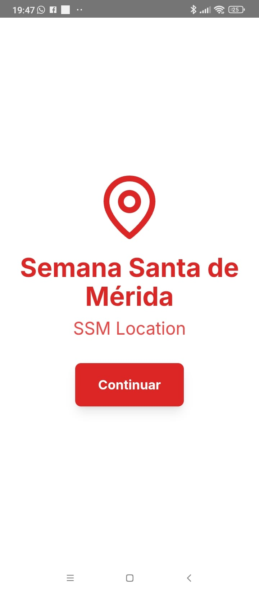
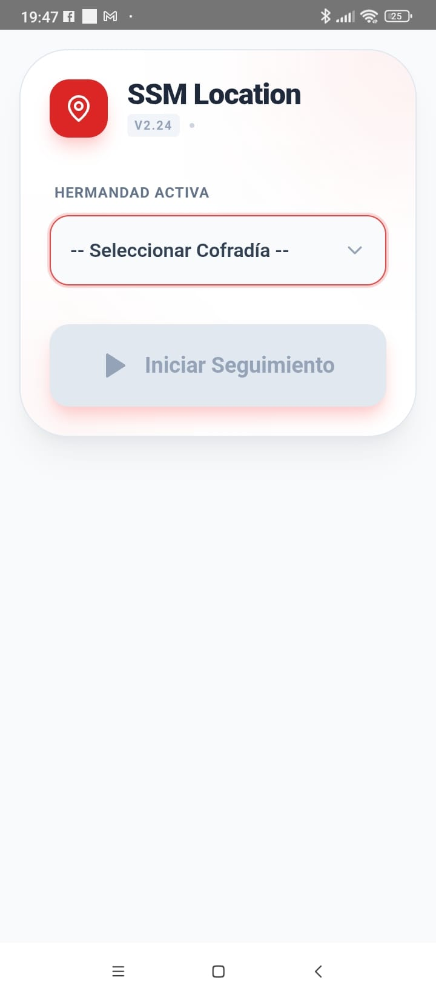
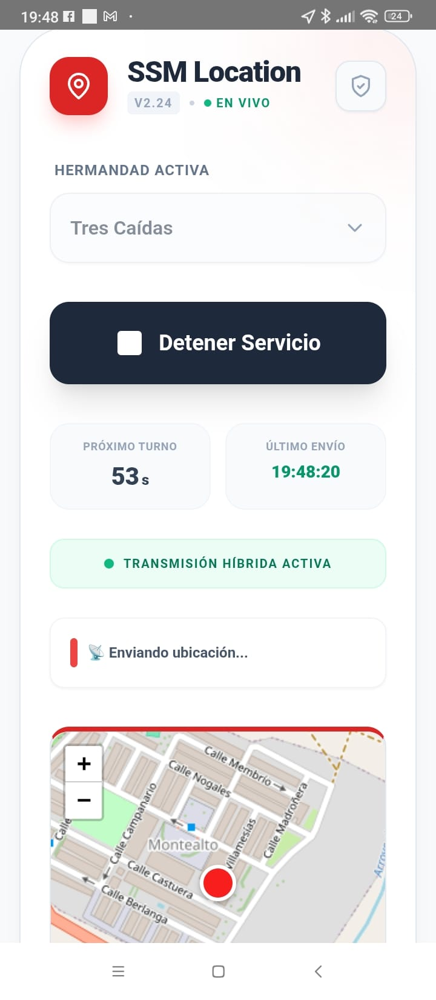
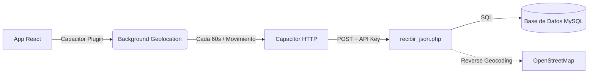

# SSM Location - Seguimiento en Tiempo Real

Aplicación móvil híbrida desarrollada con **React**, **Capacitor** y **Vite** para el seguimiento GPS en tiempo real de las Hermandades de la **Semana Santa de Mérida**.

## 🚀 Características Principales

- **Tracking en Segundo Plano**: Utiliza procesos nativos de Android para seguir enviando la ubicación incluso con la pantalla bloqueada o la app minimizada.
- **Geococing Inverso**: Convierte coordenadas GPS en direcciones legibles (Calles/Números) en tiempo real.
- **Interfaz Premium**: Diseño moderno optimizado para su uso en exteriores.
- **Bajo Consumo**: Optimizado para minimizar el impacto en la batería del dispositivo.

## 📱 Interfaz de la Aplicación

<p align="center">
  
  
  
</p>

## 🗺️ Funcionamiento del Sistema



## 🛠️ Tecnologías

- **Frontend**: React.js + Vite.
- **Nativo**: Capacitor.js (Android).
- **Plugins Críticos**:
  - `@capacitor-community/background-geolocation`: Motor del servicio en segundo plano.
  - `@capacitor/geolocation`: Posicionamiento estándar.
  - `@capacitor/core`: Comunicación nativa.

## ⚙️ Configuración Requerida (Variables de Entorno)

Para que la aplicación pueda comunicarse con el servidor y la base de datos, debes crear manualmente los siguientes archivos (excluidos de Git por seguridad):

### 1. Aplicación Frontend (`.env`)
En el directorio raíz, crea un archivo llamado `.env` basado en `.env.example`:
```env
VITE_API_URL=http://tu-servidor.com/recibir_json.php
VITE_API_KEY=tu_clave_secreta
```

### 2. Backend PHP (`config.php`)
En el directorio raíz (para subirlo a tu servidor), crea un archivo llamado `config.php`:
```php
<?php
$DB_ADDRESS = 'localhost:3306';
$DB_USER = 'tu_usuario';
$DB_PASS = 'tu_contraseña';
$DB_NAME = 'tu_base_de_datos';
$APP_SECRET = 'tu_clave_secreta'; // Debe coincidir con VITE_API_KEY
?>
```

## 📦 Instalación y Desarrollo

Para trabajar en este proyecto localmente:

1. **Instalar dependencias**:
   ```bash
   npm install
   ```

2. **Ejecutar en modo desarrollo (Web)**:
   ```bash
   npm run dev
   ```

3. **Compilar para Android**:
   ```bash
   npm run build
   # Sincronizar con la carpeta nativa
   npx cap sync android
   # Abrir en Android Studio
   npx cap open android
   ```

## 📋 Requisitos de Dispositivo (Android)

Para que el seguimiento en segundo plano funcione correctamente, el usuario debe:
1. Otorgar permiso de ubicación **"Permitir todo el tiempo"**.
2. Desactivar la **Optimización de Batería** para esta aplicación.

---
## ⚖️ Licencia

Este proyecto está bajo la licencia **Creative Commons Atribución-CompartirIgual (CC BY-SA)**. Consulta el archivo [LICENSE](LICENSE) para más detalles.

© 2026 - Propiedad de la Junta de Cofradías de Mérida.  
Desarrollado por Rubén D. Mancera Morán.
